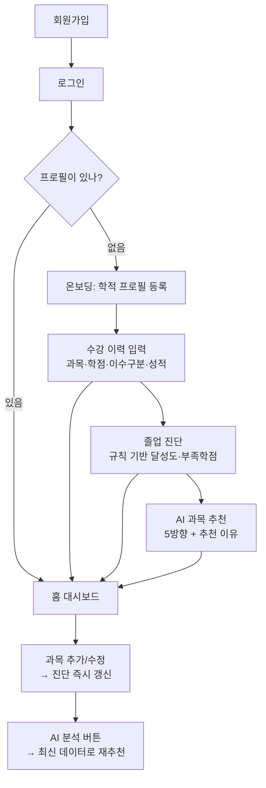

# PassPort — 서비스 소개 · 기능 · 유저 플로우

> 멋쟁이사자처럼 14기 미니프로젝트 3팀 · 운영진 설명용 문서 (2/2 중 ①)
> 짝 문서: [PassPort — 아키텍처·워크플로우·진행상황](PassPort_아키텍처_워크플로우_진행상황.md)

---

## 1. 한 줄 소개

**수강 이력을 입력하면 졸업 요건 달성도를 진단하고, 다음 학기에 들을 과목을 AI가 추천해 주는 개인화 학사 대시보드.**

- 서비스명 : **PassPort** (졸업으로 가는 여권)
- 대상 : 을지대학교 **빅데이터인공지능전공** 학생 (요건을 정확히 수치화하기 위해 한 학과로 범위 고정)
- 형태 : 웹 서비스

---

## 2. 어떤 문제를 푸나

학생들이 겪는 실제 불편:

| 문제 | PassPort의 해결 |
|---|---|
| "내가 졸업까지 뭐가 얼마나 부족하지?" 를 매번 손으로 계산 | 수강 이력만 넣으면 **졸업 요건 달성도·부족 학점을 자동 계산** |
| "다음 학기 뭘 들어야 유리하지?" 감으로 결정 | 부족한 요건 + 내 학습 성향 기반으로 **AI가 과목을 이유와 함께 추천** |
| 학사 정보가 여기저기 흩어져 있음 | **한 대시보드**에 달성도·성적 추이·인증 상태를 모아 보여줌 |

---

## 3. 핵심 원칙 (이 서비스를 신뢰할 수 있는 이유)

> **판정은 규칙, AI는 선택·설명.**

- **졸업 가능 여부·학점 계산·GPA·요건 충족 판정**은 전부 **규칙 기반 코드**로 결정론적으로 계산합니다. AI에게 맡기지 않습니다.
- **AI(Gemini)** 가 관여하는 곳은 딱 두 군데 — ① 수강 이력 텍스트 파싱 ② 추천 과목 선택 + 추천 이유 설명.
- 즉 "학점이 몇 점인지"는 AI가 지어내지 않고, "무슨 과목이 너한테 좋은지"만 AI가 거들게 설계했습니다.

---

## 4. 주요 기능

| 구분 | 기능 | 설명 |
|---|---|---|
| 인증 | 회원가입 / 로그인 | 이메일·비밀번호(암호화 저장) + JWT 로그인 |
| 프로필 | 학적 등록 | 학과·학번·입학연도 등 등록 (계정당 1개) |
| 수강 이력 | 입력 / 조회 / 수정 / 삭제 | 과목·학점·이수구분·성적 관리 (드롭다운 또는 복붙 AI 파싱) |
| 졸업 인증 | 어학·봉사·논문 체크 | 인증 요건 충족 상태 관리 |
| **졸업 진단** | 요건 달성도 | 수강 이력과 요건을 비교해 **달성도·부족 학점**을 규칙으로 계산 |
| **성적 트렌드** | 학기별 GPA | 학기별 평점 추이 + 다음 학기 예측 |
| **AI 추천** | 과목 추천 | 부족 요건 + 학습 성향 기반 **5가지 방향**으로 과목 추천 (이유 포함) |
| 대시보드 | 홈 집계 | 달성도 요약·부족 항목·성향을 한눈에 |

### AI 추천의 "5가지 방향" (차별 포인트)

같은 부족 요건이라도 학생마다 원하는 게 달라서, 추천을 5가지 성격으로 나눠 제시합니다:

| 방향 | 성격 |
|---|---|
| 졸업 집중형 (FAST_GRAD) | 부족한 졸업 요건부터 빠르게 채우기 |
| 전공 심화형 (MAJOR_DEEP) | 전공 역량을 깊게 |
| 학점 안정형 (GRADE_SAFE) | 성적 부담이 적은 과목 위주 |
| 시험 단독형 (EXAM_SOLO) | 팀플보다 개인 시험 위주 |
| 팀플 활동형 (TEAM_ACTIVE) | 팀 프로젝트·발표 활동 위주 |

> 추천 이유도 학생의 **학습 성향(persona)** — 예: "균형 성장형" — 을 반영해 개인화됩니다.

---

## 5. 유저 플로우 (사용자가 겪는 순서)



### 화면별 흐름 설명

1. **회원가입 → 로그인** : 이메일로 가입하고 로그인하면 인증 토큰을 받습니다.
2. **온보딩 분기** : 프로필이 없으면 학적 등록 화면으로, 있으면 바로 대시보드로 갑니다.
3. **수강 이력 입력** : 지금까지 들은 과목을 넣습니다. (한 과목씩 또는 성적표를 붙여넣어 AI가 파싱)
4. **졸업 진단** : 입력 즉시 "총 몇/130학점, 달성도 몇 %, 어느 구분이 몇 학점 부족" 을 규칙으로 계산해 보여줍니다.
5. **AI 추천** : "AI 분석" 버튼을 누르면 부족 요건 + 성향에 맞춰 5방향으로 과목을 이유와 함께 추천합니다.
6. **대시보드** : 달성도·부족 항목·성적 추이·성향을 모아 보여줍니다. 과목을 추가하면 진단이 바로 갱신됩니다.

---

## 6. 시연 시나리오 (발표에서 보여줄 흐름)

```
① 로그인 → 마이페이지(학적 정보)
② 졸업 진단 / 대시보드 (달성도 + 학습 성향)
③ AI 추천 5방향 확인
④ 과목을 라이브로 추가 → 진단이 즉시 반영되는 것 시연
⑤ "AI 분석" 버튼 → 최신 데이터로 다시 추천되는 것 시연 (하이라이트)
```

---

## 7. 데이터에 대한 정직한 고지

시연용 데이터 일부는 실측이 아니라 임의값·추정치입니다. 발표에서 "전부 실제 데이터"라고 말하지 않습니다.

- 데모 학생의 일부 학기 성적은 성적조회 기간 밖이라 임의값입니다.
- 추천 이유에 쓰이는 강의평가 특성 일부는 과목 성격 기반 추정치입니다(실측과 구분해 표기).
- 졸업 요건 수치는 하드코딩 값이며 일부 항목은 학과 원본 대조가 진행 중입니다.

> 이렇게 구분해 두는 것 자체가 "판정은 규칙, AI는 보조" 원칙의 연장선입니다 — 근거 없는 값으로 학생을 오도하지 않기 위함입니다.

---

## 8. 요약

PassPort는 **"졸업까지 얼마나 남았고, 다음에 뭘 들으면 좋은지"** 를 한 화면에서 답해 주는 서비스입니다. 사실 판정은 규칙이 책임지고, AI는 선택과 설명만 거들어 **믿을 수 있으면서도 개인화된** 학사 도우미를 지향합니다.

기술 구조·개발 워크플로우·현재 진행 상황은 짝 문서 [아키텍처·워크플로우·진행상황](PassPort_아키텍처_워크플로우_진행상황.md) 에서 이어집니다.
