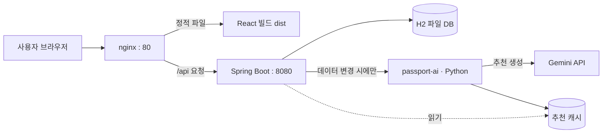
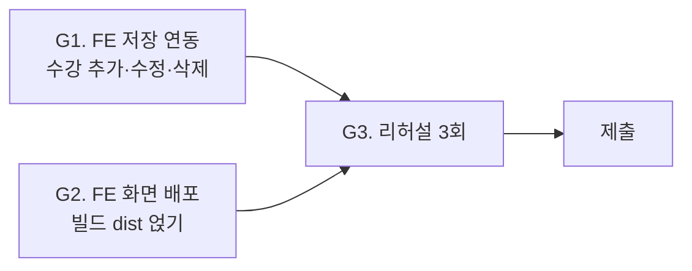

# PassPort — 아키텍처 · 워크플로우 · 진행상황

> 멋쟁이사자처럼 14기 미니프로젝트 3팀 · 운영진 설명용 문서 (2/2 중 ②)
> 짝 문서: [PassPort — 서비스 소개·기능·유저 플로우](PassPort_소개_서비스_유저플로우.md)
> 기준일 : 2026-07-16

---

## 1. 팀 구성

| 이름 | 역할 |
|---|---|
| 송원석 | PM + 백엔드 |
| 이은종 | 백엔드 |
| 황인서 | 프론트엔드 |
| 임신영 | 디자인 |

---

## 2. 기술 스택

| 영역 | 선택 |
|---|---|
| 백엔드 | Java 21 + Spring Boot 3.3 |
| 인증 | Spring Security + JWT + BCrypt |
| DB | H2 (파일 모드, 영속) |
| AI | Google Gemini API (Python 컴포넌트 `passport-ai` 경유) |
| 프론트엔드 | React + Vite |
| 배포 | AWS EC2 + nginx |
| 협업 | GitHub · Notion · Slack |

---

## 3. 시스템 구조



### 구조 설명

- **nginx** : 사용자의 첫 관문. `/api` 로 시작하는 요청은 백엔드로 넘기고, 나머지는 화면(FE) 파일을 돌려줍니다. FE와 API가 **같은 주소(같은 출처)** 라서 브라우저 보안 이슈(CORS·혼합 콘텐츠)가 생기지 않습니다.
- **Spring Boot** : 실제 서비스 로직. 인증·진단·GPA·대시보드 등 **사실 판정은 전부 여기서 규칙으로** 계산합니다.
- **H2 DB** : 사용자·프로필·수강·인증 데이터를 파일로 영속 저장(재시작해도 유지).
- **passport-ai (Python)** : 추천/성향 분석 전용. **데이터가 바뀌었을 때만** Spring이 호출하고, 결과는 캐시에 저장해 재사용합니다. 조회는 캐시에서 바로 서빙(AI 미호출).

---

## 4. 코드 구조 (도메인형 수직 분리)

9개 도메인이 각각 `controller / service / domain / repository / dto` 를 자기 안에 갖는 구조입니다.

```
com.passport
├─ global        (공통: 보안·에러핸들러·응답 래퍼)
├─ auth          (회원가입·로그인·내정보)
├─ profile       (학적 프로필)
├─ course        (수강 이력 + GPA 계산)
├─ certification (졸업 인증 체크)
├─ diagnosis     (졸업 진단 — 규칙)
├─ gpa           (성적 트렌드 — 규칙)
├─ recommendation(AI 추천)
├─ requirement   (졸업 요건 기준)
├─ dashboard     (홈 집계)
└─ persona       (학습 성향 분석)
```

- **총 21개 REST 엔드포인트** — 인증 전 허용은 회원가입·로그인 2개뿐, 나머지는 전부 인증 필수.
- **본인 리소스만 접근** — 모든 프로필 관련 요청은 "토큰의 주인 == 그 프로필 주인" 을 단일 관문에서 검증합니다.

---

## 5. 개발 원칙 · 워크플로우

### 개발 원칙

| 원칙 | 내용 |
|---|---|
| 사실은 규칙, AI는 보조 | 졸업·학점·GPA 판정은 코드로 결정. AI는 파싱·추천·설명만 |
| AI는 생성 시 1회 + 캐싱 | 조회마다 AI를 부르지 않고, 데이터 변경 시에만 생성. 장애 시 캐시로 폴백 |
| 시크릿은 환경변수만 | API 키·서명키를 코드·저장소에 하드코딩하지 않음 |
| API 명세가 단일 기준 | 계약을 바꾸려면 명세부터. FE가 이 계약에 의존 |
| 완성도 우선 | 기능을 넓히기보다 적은 기능을 서비스 수준으로 |

### Git 워크플로우

- `main` + `feature/<도메인>` 브랜치, 작은 단위로 자주 커밋 (`feat:` / `fix:` / `docs:`)
- 시크릿(`.env`·DB·키)은 `.gitignore`로 차단 — 저장소에 절대 올리지 않음

### 개발 순서 (수직 슬라이스)

로그인 → 프로필 → 수강 입력까지 화면을 관통시킨 뒤, 진단·GPA(규칙) → AI 추천 → 대시보드·캐싱 순으로 살을 붙였습니다. 각 단계는 "컨트롤러가 실제 응답을 반환" 을 완료 기준으로 삼았습니다.

---

## 6. 현재 진행 상황

### 완료된 것 ✅

- 백엔드 전체 기능 (인증·프로필·수강·진단·GPA·추천·대시보드·요건)
- AWS EC2 배포 + 상시 가동 (자동 복구 설정)
- nginx 외부 공개 설정 + `/api` 프록시 (외부 접속 동작 확인)
- AI 추천 캐시 사전 생성
- **전체 시스템 검토** — 코드·보안·연동·AI 전수 점검 결과 **발표를 막는 문제 0건** (별도 검토 보고서 존재)

### 남은 것 (제출 게이트) 🔜



| 게이트 | 상태 | 내용 |
|---|---|---|
| G1. FE 저장 연동 | 진행 | 화면에서 입력한 수강 이력을 서버에 저장하는 연동 (프론트 작업) |
| G2. FE 화면 배포 | 거의 완료 | 서버(nginx)는 준비 완료. FE 빌드 결과만 얹으면 됨 |
| G3. 리허설 3회 | 예정 | 전체 흐름 점검 (정상 / 폴백 / 라이브 추가) |

### 안정성 요약

- **서버** : 자동 복구(다운 시 재기동) + 메모리 여유 + 예비 메모리(스왑) 확보
- **AI** : 실패해도 서버가 죽지 않도록 별도 프로세스 + 타임아웃 + 캐시 폴백으로 격리
- **보안** : 본인 리소스만 접근, 시크릿 미노출, 위조 토큰 차단 — 코드와 실서버 양쪽에서 검증

---

## 7. 일정

| 시점 | 일정 |
|---|---|
| ~7/16 | 백엔드·배포·검토 완료 |
| 7/17 22:00 | **코드 제출** (20:00 목표) |
| 7/20 | **발표** |

---

## 8. 한 문장 요약

**규칙 기반 진단 위에 AI 추천을 얹은 개인화 학사 대시보드**를, 실서비스 수준의 배포·보안·안정성까지 갖춰 만들고 있습니다. 백엔드·배포·검토는 마무리됐고, 남은 것은 프론트 연동과 리허설입니다.

> 서비스가 무엇을 하는지·사용자가 어떻게 쓰는지는 짝 문서 [서비스 소개·유저 플로우](PassPort_소개_서비스_유저플로우.md) 를 참고하세요.
